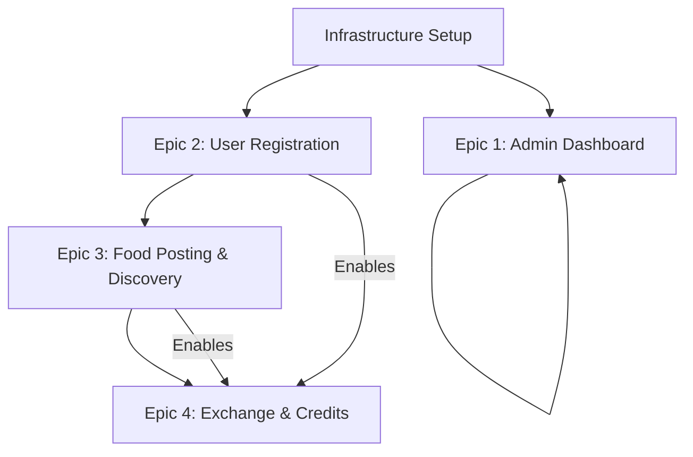

# Development Roadmap - Neighborhood Sharing Platform

## Overview

This document provides the complete development roadmap for the Neighborhood Sharing Platform MVP, incorporating all epics, stories, and implementation priorities validated through the Product Owner Master Checklist.

## Project Status Summary

- **Project Type:** Greenfield with UI components (Telegram bot + admin dashboard)
- **Architecture Readiness:** 95% (3,240+ lines of comprehensive documentation)
- **Epic Coverage:** 4 complete epics with 17 development-ready stories
- **PO Validation:** ✅ APPROVED for development
- **Estimated Development Time:** 12-16 weeks for complete MVP

## Epic Priority & Dependencies

### Epic Execution Order

## Phase 1: Foundation (Weeks 1-4)

### Infrastructure Setup (Week 1)
- Set up development environment with Docker Compose
- Initialize PostgreSQL, Redis, Elasticsearch infrastructure
- Configure CI/CD pipeline with GitHub Actions
- Set up monitoring and logging infrastructure

### Epic 2: User Registration & Verification (Weeks 2-4)

#### Week 2: Core Registration
- **Story 2.1:** Telegram Bot Registration Flow
  - Priority: Critical
  - Dependencies: Bot framework setup, user database schema
  - Estimated effort: 3-4 days

#### Week 3: Verification Systems  
- **Story 2.2:** Phone Number Verification
  - Priority: Critical
  - Dependencies: SMS service integration
  - Estimated effort: 3-4 days
- **Story 2.3:** Location Verification  
  - Priority: High
  - Dependencies: Geographic service area configuration
  - Estimated effort: 2-3 days

#### Week 4: Profile Completion
- **Story 2.4:** User Profile Completion
  - Priority: Medium
  - Dependencies: Preference schema, credit system foundation
  - Estimated effort: 2-3 days

## Phase 2: Core Food Sharing (Weeks 5-9)

### Epic 3: Food Posting & Discovery (Weeks 5-8)

#### Week 5: Food Posting
- **Story 3.1:** Food Posting Workflow
  - Priority: Critical
  - Dependencies: S3 integration, photo processing pipeline
  - Estimated effort: 4-5 days

#### Week 6-7: Discovery System
- **Story 3.2:** Food Discovery & Browsing
  - Priority: Critical  
  - Dependencies: Search optimization, location filtering
  - Estimated effort: 5-6 days
- **Story 3.3:** Food Request System
  - Priority: Critical
  - Dependencies: Notification system, state management
  - Estimated effort: 3-4 days

#### Week 8: Post Management
- **Story 3.4:** Food Post Management
  - Priority: Medium
  - Dependencies: Post lifecycle management
  - Estimated effort: 2-3 days

### Epic 4 Foundation (Week 9)
- Set up exchange state management infrastructure
- Implement credit system database schema
- Prepare notification infrastructure for exchange coordination

## Phase 3: Exchange Coordination (Weeks 10-13)

### Epic 4: Exchange Coordination & Credit System (Weeks 10-13)

#### Week 10: Exchange Management
- **Story 4.1:** Exchange Request & Confirmation
  - Priority: Critical
  - Dependencies: State machine implementation, credit integration
  - Estimated effort: 4-5 days

#### Week 11: Pickup Coordination  
- **Story 4.2:** Pickup Coordination
  - Priority: High
  - Dependencies: Scheduling system, message relay
  - Estimated effort: 3-4 days

#### Week 12: Completion System
- **Story 4.3:** Exchange Completion & Rating
  - Priority: High  
  - Dependencies: Rating system, reputation calculation
  - Estimated effort: 3-4 days

#### Week 13: Credit System
- **Story 4.4:** Credit System Implementation
  - Priority: Critical
  - Dependencies: Transaction safety, audit logging
  - Estimated effort: 4-5 days

## Phase 4: Operations & Polish (Weeks 14-16)

### Epic 1: Admin Dashboard (Week 14-15)

#### Week 14: Admin Foundation
- **Story 1.1:** Admin Authentication & Basic Dashboard Shell
  - Priority: Medium
  - Dependencies: Admin user management, dashboard framework
  - Estimated effort: 3-4 days

#### Week 15: Admin Features
- **Story 1.2:** Business Metrics Visualization
  - Priority: Medium
  - Dependencies: Elasticsearch dashboard integration
  - Estimated effort: 2-3 days
- **Story 1.3:** User Report Management Interface
  - Priority: Medium
  - Dependencies: Report data structures, admin workflows
  - Estimated effort: 2-3 days

### Final Integration & Launch Prep (Week 16)
- End-to-end testing and performance optimization
- Production deployment and monitoring setup
- User documentation and support materials
- Launch readiness validation

## Story Implementation Details

### Critical Path Stories (Must Complete First)
1. **Story 2.1:** Telegram Bot Registration Flow
2. **Story 2.2:** Phone Number Verification
3. **Story 3.1:** Food Posting Workflow
4. **Story 3.2:** Food Discovery & Browsing
5. **Story 3.3:** Food Request System
6. **Story 4.1:** Exchange Request & Confirmation
7. **Story 4.4:** Credit System Implementation

### High Priority Stories (Core MVP)
1. **Story 2.3:** Location Verification
2. **Story 4.2:** Pickup Coordination
3. **Story 4.3:** Exchange Completion & Rating

### Medium Priority Stories (Enhanced MVP)
1. **Story 2.4:** User Profile Completion
2. **Story 3.4:** Food Post Management
3. **Story 1.1-1.3:** Admin Dashboard Stories

## Technical Milestones

### Milestone 1: User Onboarding (End of Week 4)
- Users can register via Telegram bot
- Phone verification working
- Basic location verification
- Foundation for food sharing ready

### Milestone 2: Food Sharing Core (End of Week 8)  
- Users can post food with photos
- Discovery and browsing functional
- Request system operational
- Basic food sharing workflow complete

### Milestone 3: Exchange System (End of Week 13)
- Complete exchange coordination
- Credit system fully operational
- Rating and reputation system
- Full MVP functionality achieved

### Milestone 4: Production Ready (End of Week 16)
- Admin dashboard operational
- Full monitoring and alerting
- Production deployment complete
- Launch-ready platform

## Risk Mitigation Timeline

### Week 1-2: Infrastructure Risks
- **Risk:** Development environment complexity
- **Mitigation:** Docker Compose simplification, clear setup documentation

### Week 3-4: External Integration Risks  
- **Risk:** SMS verification service reliability
- **Mitigation:** Multiple provider support, fallback mechanisms

### Week 5-7: Performance Risks
- **Risk:** Photo upload and processing performance
- **Mitigation:** Async processing, compression optimization

### Week 8-10: State Management Risks
- **Risk:** Complex exchange state transitions
- **Mitigation:** Comprehensive testing, state machine validation

### Week 11-13: Credit System Risks
- **Risk:** Transaction consistency and audit trail
- **Mitigation:** Database transaction testing, audit log validation

### Week 14-16: Production Risks
- **Risk:** Scalability and monitoring gaps
- **Mitigation:** Load testing, comprehensive monitoring setup

## Success Metrics by Phase

### Phase 1 Success Criteria
- 100% of users can complete registration flow
- Phone verification success rate >95%
- Location verification accuracy 100%

### Phase 2 Success Criteria  
- Food posting completion rate >90%
- Average time from post to first request <15 minutes
- Search and discovery performance <2 seconds

### Phase 3 Success Criteria
- Exchange completion rate >85%
- Credit system transaction accuracy 100%
- User satisfaction rating >4.0 stars

### Phase 4 Success Criteria
- Admin dashboard provides full operational visibility
- Production monitoring covers all critical metrics
- Platform ready for user acquisition

## Resource Allocation

### Development Team Recommendations
- **Backend Developer:** Focus on Epic 2, 4 (user systems, credit logic)
- **Bot Developer:** Focus on Epic 3 (Telegram bot interactions)
- **DevOps Engineer:** Infrastructure setup and Epic 1 (admin dashboard)
- **QA Engineer:** Cross-cutting testing across all epics

### External Dependencies
- **SMS Verification Service:** Setup required by Week 3
- **S3 Storage Configuration:** Setup required by Week 5
- **Domain and SSL Certificates:** Setup required by Week 14

## Post-MVP Roadmap

### Immediate Post-Launch (Weeks 17-20)
1. ML-based recommendation engine implementation
2. Advanced search and filtering capabilities
3. Mobile app planning and prototyping
4. Multi-building expansion preparation

### Future Enhancements (Months 6-12)
1. Mobile application development
2. Advanced analytics and business intelligence
3. Community management features
4. Integration with local food services

This roadmap provides a comprehensive guide for developing the Neighborhood Sharing Platform MVP, with clear priorities, dependencies, and success criteria for each phase of development.