# System Architecture Diagrams - Neighborhood Sharing Platform

**Version:** 1.0  
**Date:** January 2024  
**Environment:** MVP Development  

---

## Overview

This document provides comprehensive system architecture diagrams and technical specifications for the Neighborhood Sharing Platform MVP. The architecture follows a microservices approach with Telegram bot as the primary interface.

---

## 1. High-Level System Architecture

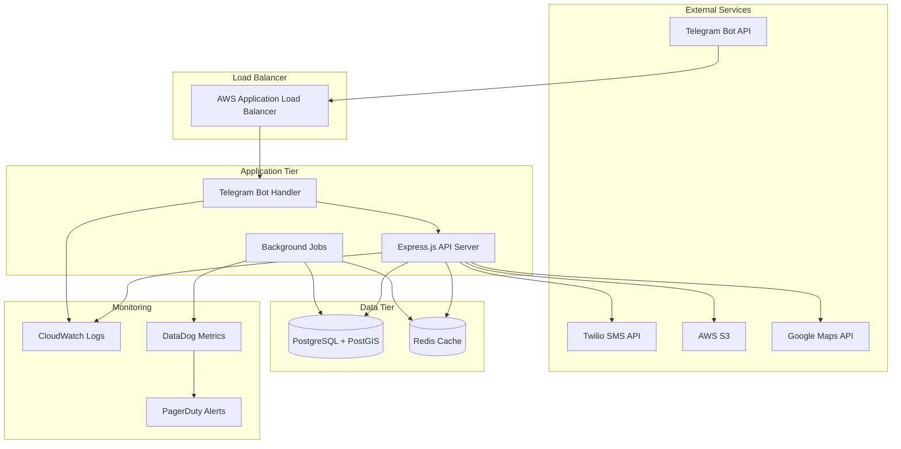

---

## 2. Telegram Bot Architecture

```mermaid
graph TD
    subgraph "Telegram Infrastructure"
        USERS[Telegram Users]
        TGAPI[Telegram Bot API]
    end
    
    subgraph "Our Infrastructure"
        WEBHOOK[Webhook Endpoint]
        ROUTER[Command Router]
        MIDDLEWARE[Middleware Stack]
        
        subgraph "Command Handlers"
            START[/start Handler]
            SHARE[/share Handler]
            BROWSE[/browse Handler]
            REQUEST[/request Handler]
            CREDITS[/credits Handler]
            RATE[/rate Handler]
            REPORT[/report Handler]
        end
        
        subgraph "Services"
            USER_SVC[User Service]
            FOOD_SVC[Food Service]
            EXCHANGE_SVC[Exchange Service]
            CREDIT_SVC[Credit Service]
            NOTIFY_SVC[Notification Service]
        end
        
        subgraph "Data Layer"
            DB[(PostgreSQL)]
            CACHE[(Redis)]
            FILES[AWS S3]
        end
    end
    
    USERS --> TGAPI
    TGAPI --> WEBHOOK
    WEBHOOK --> MIDDLEWARE
    MIDDLEWARE --> ROUTER
    
    ROUTER --> START
    ROUTER --> SHARE
    ROUTER --> BROWSE
    ROUTER --> REQUEST
    ROUTER --> CREDITS
    ROUTER --> RATE
    ROUTER --> REPORT
    
    START --> USER_SVC
    SHARE --> FOOD_SVC
    BROWSE --> FOOD_SVC
    REQUEST --> EXCHANGE_SVC
    CREDITS --> CREDIT_SVC
    RATE --> EXCHANGE_SVC
    REPORT --> USER_SVC
    
    USER_SVC --> DB
    FOOD_SVC --> DB
    FOOD_SVC --> FILES
    EXCHANGE_SVC --> DB
    EXCHANGE_SVC --> NOTIFY_SVC
    CREDIT_SVC --> DB
    NOTIFY_SVC --> TGAPI
    
    USER_SVC --> CACHE
    FOOD_SVC --> CACHE
```

---

## 3. Data Flow Architecture

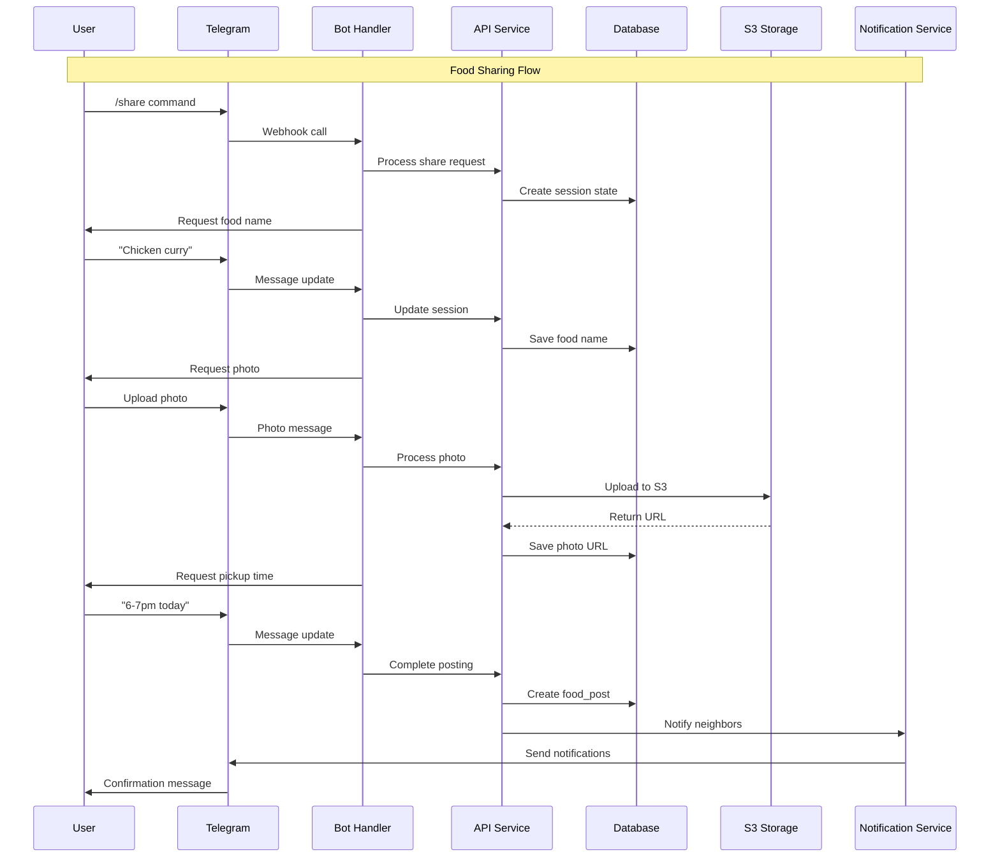

---

## 4. Database Schema & Relationships

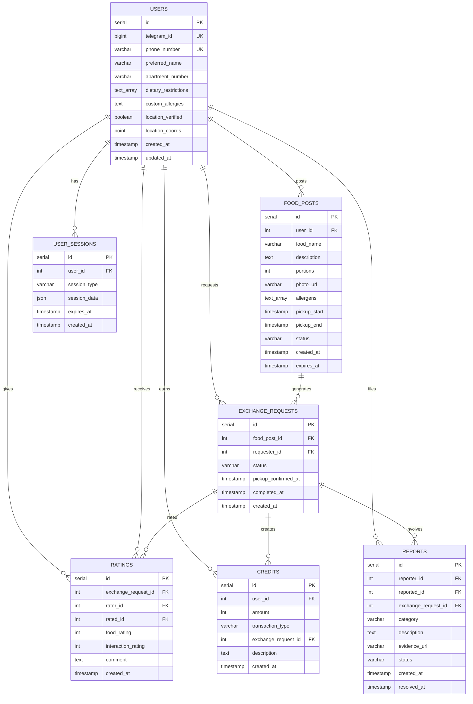

---

## 5. Service Layer Architecture

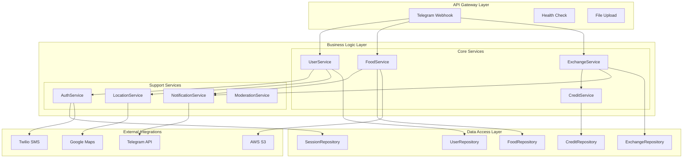

---

## 6. Infrastructure & Deployment Architecture

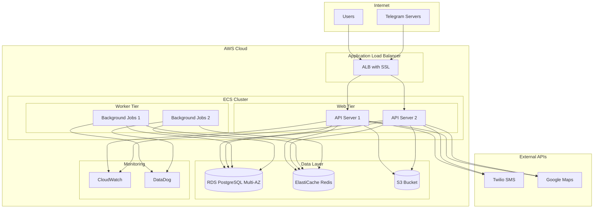

---

## 7. Security Architecture

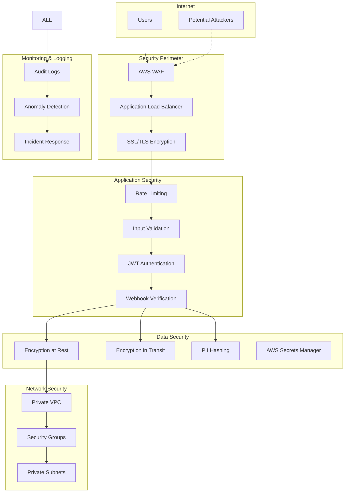

---

## 8. Caching Strategy Architecture

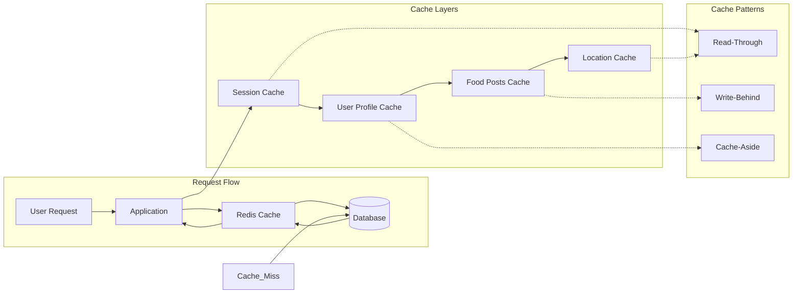

---

## 9. Background Jobs Architecture

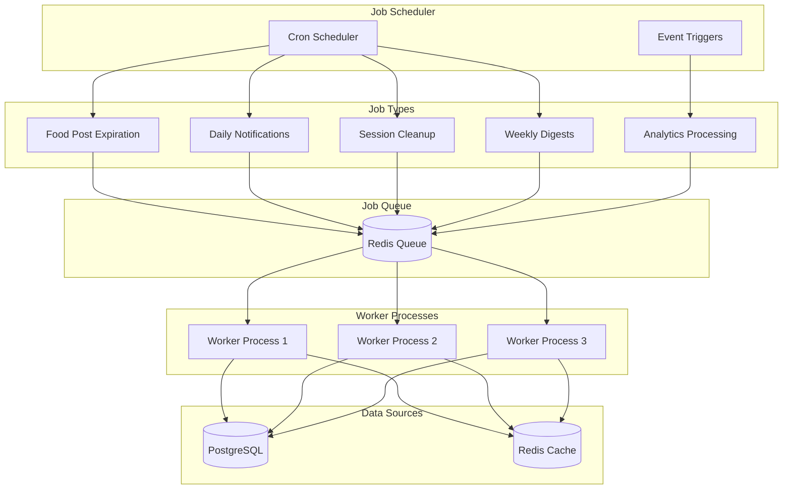

---

## 10. Monitoring & Observability Architecture

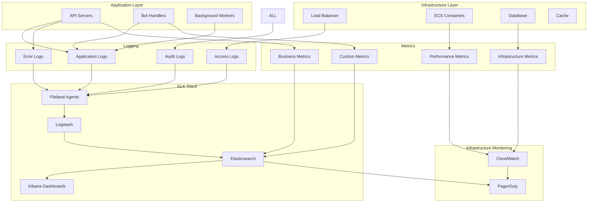

---

## 10.1. ELK Stack Detailed Architecture

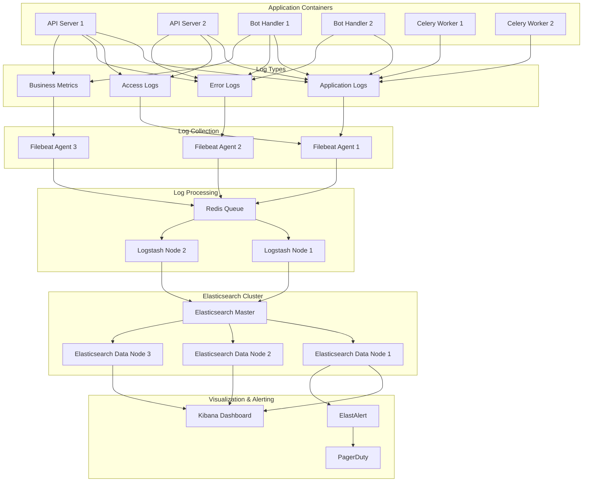

### ELK Stack Configuration

#### Elasticsearch Configuration
```yaml
# Elasticsearch cluster configuration
cluster.name: "neighborshare-logs"
node.name: "es-data-1"
node.roles: ["data", "ingest"]
network.host: 0.0.0.0
discovery.seed_hosts: ["es-master:9300"]
cluster.initial_master_nodes: ["es-master"]

# Index templates for different log types
index_patterns:
  - name: "app-logs-*"
    settings:
      number_of_shards: 2
      number_of_replicas: 1
      refresh_interval: "5s"
  
  - name: "business-metrics-*"
    settings:
      number_of_shards: 1
      number_of_replicas: 1
      refresh_interval: "30s"
```

#### Logstash Pipeline Configuration
```ruby
# Logstash pipeline for application logs
input {
  redis {
    host => "redis-queue"
    port => 6379
    key => "logstash"
    data_type => "list"
    codec => "json"
  }
}

filter {
  if [log_type] == "application" {
    grok {
      match => { 
        "message" => "%{TIMESTAMP_ISO8601:timestamp} %{LOGLEVEL:level} %{DATA:logger} %{GREEDYDATA:message}"
      }
    }
    
    date {
      match => [ "timestamp", "ISO8601" ]
    }
    
    if [level] == "ERROR" {
      mutate {
        add_tag => ["error", "alert"]
      }
    }
  }
  
  if [log_type] == "business_metrics" {
    mutate {
      add_tag => ["metrics", "business"]
    }
    
    # Parse business metrics
    if [metric_type] == "food_exchange" {
      mutate {
        add_field => { "[@metadata][index]" => "business-metrics-%{+YYYY.MM.dd}" }
      }
    }
  }
}

output {
  elasticsearch {
    hosts => ["elasticsearch:9200"]
    index => "%{[@metadata][index]}"
  }
}
```

#### Filebeat Configuration
```yaml
# Filebeat configuration for log shipping
filebeat.inputs:
- type: log
  enabled: true
  paths:
    - /app/logs/application.log
  fields:
    log_type: application
    service: api
  
- type: log
  enabled: true
  paths:
    - /app/logs/access.log
  fields:
    log_type: access
    service: api
    
- type: log
  enabled: true
  paths:
    - /app/logs/business_metrics.log
  fields:
    log_type: business_metrics
  
output.redis:
  hosts: ["redis-queue:6379"]
  key: "logstash"
  data_type: "list"
  
processors:
- add_host_metadata:
    when.not.contains.tags: forwarded
```

---

## 11. API Service Architecture

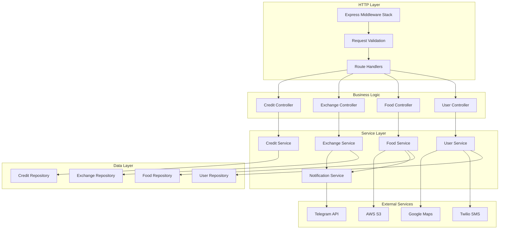

---

## 12. Technology Stack Details

### Core Technologies
```yaml
Runtime:
  - Python 3.11+ 
  - AsyncIO for concurrent operations

Framework:
  - FastAPI 0.104+ (async web framework)
  - python-telegram-bot 20.6+

Database:
  - PostgreSQL 15+ with PostGIS
  - asyncpg for async database operations
  - SQLAlchemy 2.0+ with async support

Caching:
  - Redis 7+ for sessions and caching
  - Celery + Redis for background jobs

File Storage:
  - AWS S3 for photo uploads
  - CloudFront CDN for delivery

External APIs:
  - Telegram Bot API
  - Twilio SMS API
  - Google Maps API
```

### Infrastructure
```yaml
Cloud Platform: AWS
Compute: ECS Fargate containers
Load Balancer: Application Load Balancer
Database: RDS PostgreSQL Multi-AZ
Cache: ElastiCache Redis
Storage: S3 with versioning
CDN: CloudFront
Monitoring: Elasticsearch + Kibana + Logstash (ELK Stack)
Metrics: CloudWatch for infrastructure
Secrets: AWS Secrets Manager
```

### Development Tools
```yaml
Testing: pytest + httpx + pytest-asyncio
Linting: black + flake8 + mypy
CI/CD: GitHub Actions
Infrastructure: Terraform
Container: Docker
Documentation: Sphinx + autoapi
API Docs: FastAPI automatic OpenAPI/Swagger
```

---

## 13. Scalability Considerations

### Horizontal Scaling
- **API Servers:** Auto-scaling ECS services based on CPU/memory
- **Background Workers:** Queue-based scaling for job processing
- **Database:** Read replicas for query scaling
- **Cache:** Redis cluster for distributed caching

### Performance Optimizations
- **Database Indexing:** Strategic indexes on frequent queries
- **Query Optimization:** Efficient PostGIS queries for location
- **Caching Strategy:** Multi-layer caching (session, user, content)
- **CDN Usage:** CloudFront for static assets and photos

### Resource Limits
- **File Uploads:** 5MB max photo size with compression
- **Rate Limiting:** 10 requests/minute per user
- **Concurrent Users:** 100 simultaneous bot interactions
- **Database Connections:** Connection pooling with max 20 per service

---

## 14. Disaster Recovery & High Availability

### High Availability Setup
```yaml
Multi-AZ Deployment:
  - Application: Multiple availability zones
  - Database: RDS Multi-AZ with automatic failover
  - Cache: ElastiCache Multi-AZ replication
  - Load Balancer: Cross-zone load balancing

Backup Strategy:
  - Database: Daily automated backups with 7-day retention
  - Files: S3 versioning and cross-region replication
  - Configuration: Terraform state in S3 with versioning
```

### Recovery Procedures
- **RTO (Recovery Time Objective):** 15 minutes
- **RPO (Recovery Point Objective):** 1 hour
- **Automated Failover:** Database and cache layers
- **Manual Procedures:** Application tier recovery

---

This comprehensive architecture supports the MVP requirements while providing scalability and maintainability for future growth phases.