# User Flows - Neighborhood Sharing Platform

**Version:** 1.0  
**Date:** January 2024  
**Purpose:** User validation and UX design  

---

## Overview

This document provides comprehensive user flow diagrams and journey maps for validating the Neighborhood Sharing Platform with real users. These flows will guide wireframe creation, usability testing, and feature validation.

---

## 1. Primary User Journey: Complete Food Sharing Cycle

```mermaid
flowchart TD
    START([User opens Telegram]) --> DISCOVER{How did they discover bot?}
    
    DISCOVER -->|Friend referral| FRIEND[Friend shows them bot]
    DISCOVER -->|Building flyer| FLYER[Sees QR code on flyer]
    DISCOVER -->|Word of mouth| WORD[Heard about it]
    
    FRIEND --> SEND_START[Friend sends bot contact]
    FLYER --> SCAN_QR[Scans QR code]
    WORD --> SEARCH[Searches bot name]
    
    SEND_START --> START_BOT[Clicks "Start" button]
    SCAN_QR --> START_BOT
    SEARCH --> START_BOT
    
    START_BOT --> WELCOME[Sees welcome message]
    WELCOME --> PHONE_REQ[Bot requests phone number]
    
    PHONE_REQ --> PHONE_DECISION{Comfortable sharing phone?}
    PHONE_DECISION -->|Yes| SHARE_PHONE[Shares phone number]
    PHONE_DECISION -->|No| PHONE_CONCERN[Has privacy concerns]
    
    PHONE_CONCERN --> EXPLAIN_WHY[Bot explains why phone needed]
    EXPLAIN_WHY --> TRUST_DECISION{Trusts explanation?}
    TRUST_DECISION -->|Yes| SHARE_PHONE
    TRUST_DECISION -->|No| ABANDON[Abandons registration]
    
    SHARE_PHONE --> SMS_SENT[Receives SMS code]
    SMS_SENT --> ENTER_CODE[Enters verification code]
    ENTER_CODE --> CODE_VALID{Code correct?}
    
    CODE_VALID -->|No| RETRY_CODE[Tries again]
    RETRY_CODE --> ENTER_CODE
    CODE_VALID -->|Yes| LOCATION_REQ[Bot requests location]
    
    LOCATION_REQ --> LOCATION_DECISION{Comfortable sharing location?}
    LOCATION_DECISION -->|Yes| SHARE_LOCATION[Shares current location]
    LOCATION_DECISION -->|No| MANUAL_ADDRESS[Enters address manually]
    
    SHARE_LOCATION --> LOCATION_VERIFY[Bot verifies building proximity]
    MANUAL_ADDRESS --> LOCATION_VERIFY
    
    LOCATION_VERIFY --> IN_BUILDING{Within building radius?}
    IN_BUILDING -->|Yes| PROFILE_SETUP[Sets up profile preferences]
    IN_BUILDING -->|No| LOCATION_ERROR[Location verification failed]
    
    LOCATION_ERROR --> RETRY_LOCATION[Try different location method]
    RETRY_LOCATION --> LOCATION_REQ
    
    PROFILE_SETUP --> DIETARY[Selects dietary restrictions]
    DIETARY --> APT_NUMBER[Enters apartment number]
    APT_NUMBER --> PREFERRED_NAME[Sets preferred name]
    PREFERRED_NAME --> REGISTRATION_COMPLETE[Registration complete!]
    
    REGISTRATION_COMPLETE --> MAIN_MENU[Shows main menu options]
    MAIN_MENU --> FIRST_ACTION{What do they want to do first?}
    
    FIRST_ACTION -->|Share food| SHARE_FLOW[Go to sharing flow]
    FIRST_ACTION -->|Browse food| BROWSE_FLOW[Go to browsing flow]
    FIRST_ACTION -->|Learn more| HELP_FLOW[Go to help/tutorial]
    
    SHARE_FLOW --> SHARE_SUCCESS[Successfully posts food]
    BROWSE_FLOW --> BROWSE_SUCCESS[Successfully finds food to request]
    HELP_FLOW --> TUTORIAL_COMPLETE[Completes tutorial]
    
    SHARE_SUCCESS --> ENGAGEMENT[High engagement likelihood]
    BROWSE_SUCCESS --> ENGAGEMENT
    TUTORIAL_COMPLETE --> CONFIDENT_USER[More confident user]
    CONFIDENT_USER --> ENGAGEMENT
    
    ABANDON --> LOST_USER[User lost - collect feedback]
    LOST_USER --> FEEDBACK[Exit survey opportunity]
```

---

## 2. Food Sharing Flow (Provider Journey)

```mermaid
flowchart TD
    START([User wants to share food]) --> TRIGGER{What triggered desire to share?}
    
    TRIGGER -->|Made extra food| EXTRA[Cooked too much]
    TRIGGER -->|Going out of town| TRAVEL[Food will expire]
    TRIGGER -->|Want to be helpful| COMMUNITY[Community spirit]
    
    EXTRA --> SHARE_CMD[Types "/share" command]
    TRAVEL --> SHARE_CMD
    COMMUNITY --> SHARE_CMD
    
    SHARE_CMD --> FOOD_NAME_PROMPT[Bot asks: "What food are you sharing?"]
    FOOD_NAME_PROMPT --> FOOD_NAME_INPUT[User types food name]
    
    FOOD_NAME_INPUT --> NAME_VALIDATION{Is name clear/descriptive?}
    NAME_VALIDATION -->|No| NAME_GUIDANCE[Bot suggests being more specific]
    NAME_GUIDANCE --> FOOD_NAME_INPUT
    NAME_VALIDATION -->|Yes| PORTIONS_PROMPT[Bot asks: "How many portions?"]
    
    PORTIONS_PROMPT --> PORTIONS_INPUT[User enters number]
    PORTIONS_INPUT --> PORTIONS_VALID{Valid number 1-10?}
    PORTIONS_VALID -->|No| PORTIONS_ERROR[Bot explains valid range]
    PORTIONS_ERROR --> PORTIONS_INPUT
    PORTIONS_VALID -->|Yes| PHOTO_PROMPT[Bot asks for photo]
    
    PHOTO_PROMPT --> PHOTO_DECISION{Wants to add photo?}
    PHOTO_DECISION -->|No| SKIP_PHOTO[Skips photo]
    PHOTO_DECISION -->|Yes| TAKE_PHOTO{How to add photo?}
    
    TAKE_PHOTO -->|Camera| CAMERA[Takes new photo]
    TAKE_PHOTO -->|Gallery| GALLERY[Selects from gallery]
    
    CAMERA --> PHOTO_QUALITY{Photo quality good?}
    GALLERY --> PHOTO_QUALITY
    PHOTO_QUALITY -->|No| RETAKE[Takes another photo]
    RETAKE --> CAMERA
    PHOTO_QUALITY -->|Yes| UPLOAD[Photo uploads]
    
    UPLOAD --> UPLOAD_SUCCESS{Upload successful?}
    UPLOAD_SUCCESS -->|No| UPLOAD_ERROR[Upload failed - try again]
    UPLOAD_ERROR --> PHOTO_PROMPT
    UPLOAD_SUCCESS -->|Yes| TIMING_PROMPT[Bot asks pickup timing]
    
    SKIP_PHOTO --> TIMING_PROMPT
    
    TIMING_PROMPT --> TIMING_INPUT[User specifies when available]
    TIMING_INPUT --> TIMING_VALID{Timing makes sense?}
    TIMING_VALID -->|No| TIMING_HELP[Bot helps with format]
    TIMING_HELP --> TIMING_INPUT
    TIMING_VALID -->|Yes| ALLERGEN_PROMPT[Bot asks about allergens]
    
    ALLERGEN_PROMPT --> ALLERGEN_SELECTION[User selects applicable allergens]
    ALLERGEN_SELECTION --> PREVIEW[Bot shows post preview]
    
    PREVIEW --> PREVIEW_DECISION{Happy with preview?}
    PREVIEW_DECISION -->|No| EDIT_CHOICE[Choose what to edit]
    EDIT_CHOICE --> EDIT_NAME[Edit food name]
    EDIT_CHOICE --> EDIT_PORTIONS[Edit portions]
    EDIT_CHOICE --> EDIT_PHOTO[Edit photo]
    EDIT_CHOICE --> EDIT_TIMING[Edit timing]
    EDIT_CHOICE --> EDIT_ALLERGENS[Edit allergens]
    
    EDIT_NAME --> FOOD_NAME_INPUT
    EDIT_PORTIONS --> PORTIONS_INPUT
    EDIT_PHOTO --> PHOTO_PROMPT
    EDIT_TIMING --> TIMING_INPUT
    EDIT_ALLERGENS --> ALLERGEN_SELECTION
    
    PREVIEW_DECISION -->|Yes| CONFIRM_POST[Confirms posting]
    CONFIRM_POST --> POST_LIVE[Food post goes live]
    
    POST_LIVE --> NOTIFICATIONS[Neighbors get notified]
    NOTIFICATIONS --> WAIT_REQUESTS[Waits for requests]
    
    WAIT_REQUESTS --> REQUEST_RECEIVED{Receives request?}
    REQUEST_RECEIVED -->|No| NO_REQUESTS[No requests after 30 min]
    REQUEST_RECEIVED -->|Yes| REVIEW_REQUEST[Reviews who requested]
    
    NO_REQUESTS --> NO_REQUEST_FEELINGS{How do they feel?}
    NO_REQUEST_FEELINGS -->|Disappointed| DISAPPOINTED[Feels rejected]
    NO_REQUEST_FEELINGS -->|Neutral| NEUTRAL_SHARING[Normal experience]
    NO_REQUEST_FEELINGS -->|Understanding| UNDERSTANDING[Knows food sharing varies]
    
    DISAPPOINTED --> NEGATIVE_EXPERIENCE[Negative first experience]
    NEUTRAL_SHARING --> MIXED_EXPERIENCE[Mixed first experience]
    UNDERSTANDING --> POSITIVE_MINDSET[Maintains positive attitude]
    
    REVIEW_REQUEST --> REQUESTER_DECISION{Comfortable with requester?}
    REQUESTER_DECISION -->|No| DECLINE_REQUEST[Declines politely]
    REQUESTER_DECISION -->|Yes| ACCEPT_REQUEST[Accepts request]
    
    DECLINE_REQUEST --> WAIT_MORE[Waits for other requests]
    WAIT_MORE --> REQUEST_RECEIVED
    
    ACCEPT_REQUEST --> COORDINATE[Coordinates pickup details]
    COORDINATE --> PICKUP_ARRANGED[Pickup time/place set]
    PICKUP_ARRANGED --> PICKUP_OCCURS{Pickup happens?}
    
    PICKUP_OCCURS -->|No| NO_SHOW[Requester doesn't show]
    PICKUP_OCCURS -->|Yes| SUCCESSFUL_PICKUP[Food successfully shared]
    
    NO_SHOW --> FRUSTRATION[Feels frustrated]
    FRUSTRATION --> NEGATIVE_EXPERIENCE
    
    SUCCESSFUL_PICKUP --> INTERACTION{How was interaction?}
    INTERACTION -->|Great| GREAT_INTERACTION[Very positive experience]
    INTERACTION -->|Good| GOOD_INTERACTION[Positive experience]
    INTERACTION -->|Awkward| AWKWARD_INTERACTION[Neutral/awkward experience]
    
    GREAT_INTERACTION --> HIGHLY_LIKELY_REPEAT[Very likely to share again]
    GOOD_INTERACTION --> LIKELY_REPEAT[Likely to share again]
    AWKWARD_INTERACTION --> MAYBE_REPEAT[Might share again]
    
    HIGHLY_LIKELY_REPEAT --> RATING_PROMPT[Bot asks for rating]
    LIKELY_REPEAT --> RATING_PROMPT
    MAYBE_REPEAT --> RATING_PROMPT
    
    RATING_PROMPT --> GIVE_RATING[Rates the experience]
    GIVE_RATING --> CREDIT_EARNED[Earns sharing credit]
    CREDIT_EARNED --> POSITIVE_REINFORCEMENT[Feels good about helping]
    
    POSITIVE_REINFORCEMENT --> COMMUNITY_BUILDER[Becomes community advocate]
    NEGATIVE_EXPERIENCE --> CHURN_RISK[Risk of not using again]
    MIXED_EXPERIENCE --> MODERATE_ENGAGEMENT[Moderate future engagement]
```

---

## 3. Food Requesting Flow (Receiver Journey)

```mermaid
flowchart TD
    START([User wants food]) --> MOTIVATION{What's the motivation?}
    
    MOTIVATION -->|Hungry/no food| HUNGER[Needs a meal]
    MOTIVATION -->|Curious about neighbors| SOCIAL[Social connection]
    MOTIVATION -->|Save money| ECONOMIC[Budget conscious]
    MOTIVATION -->|Try new cuisine| VARIETY[Culinary exploration]
    
    HUNGER --> BROWSE_CMD[Types "/browse" command]
    SOCIAL --> BROWSE_CMD
    ECONOMIC --> BROWSE_CMD
    VARIETY --> BROWSE_CMD
    
    BROWSE_CMD --> LOADING[Bot loads available food]
    LOADING --> FOOD_AVAILABLE{Any food available?}
    
    FOOD_AVAILABLE -->|No| EMPTY_STATE[No food currently available]
    FOOD_AVAILABLE -->|Yes| FOOD_LIST[Shows list of available food]
    
    EMPTY_STATE --> EMPTY_RESPONSE{How do they react?}
    EMPTY_RESPONSE -->|Disappointed| DISAPPOINTED[Leave disappointed]
    EMPTY_RESPONSE -->|Understanding| PATIENT[Will check back later]
    EMPTY_RESPONSE -->|Motivated| MOTIVATED_SHARE[Decides to share instead]
    
    DISAPPOINTED --> CHURN_EARLY[Abandons platform early]
    PATIENT --> SET_REMINDER[Maybe sets reminder to check later]
    MOTIVATED_SHARE --> SHARE_FLOW[Goes to sharing flow]
    
    FOOD_LIST --> BROWSE_OPTIONS[Scans available options]
    BROWSE_OPTIONS --> FILTERING{Wants to filter?}
    
    FILTERING -->|Yes| APPLY_FILTERS[Applies dietary/preference filters]
    FILTERING -->|No| VIEW_ALL[Views all available food]
    
    APPLY_FILTERS --> FILTERED_LIST[Shows filtered results]
    FILTERED_LIST --> ENOUGH_OPTIONS{Satisfied with options?}
    
    ENOUGH_OPTIONS -->|No| ADJUST_FILTERS[Adjusts filter criteria]
    ENOUGH_OPTIONS -->|Yes| BROWSE_ITEMS[Browses individual items]
    
    ADJUST_FILTERS --> APPLY_FILTERS
    VIEW_ALL --> BROWSE_ITEMS
    
    BROWSE_ITEMS --> ITEM_DETAILS[Views item details]
    ITEM_DETAILS --> ITEM_APPEAL{Item looks appealing?}
    
    ITEM_APPEAL -->|No| NEXT_ITEM[Looks at next item]
    ITEM_APPEAL -->|Maybe| CONSIDER[Considers the option]
    ITEM_APPEAL -->|Yes| WANT_ITEM[Definitely wants it]
    
    NEXT_ITEM --> BROWSE_ITEMS
    CONSIDER --> SHARER_INFO[Checks who's sharing]
    WANT_ITEM --> SHARER_INFO
    
    SHARER_INFO --> SHARER_COMFORT{Comfortable with sharer?}
    SHARER_COMFORT -->|No| NEXT_ITEM
    SHARER_COMFORT -->|Unsure| HESITATION[Feels uncertain]
    SHARER_COMFORT -->|Yes| REQUEST_DECISION[Decides to request]
    
    HESITATION --> TRUST_FACTORS{What would build trust?}
    TRUST_FACTORS -->|Ratings| CHECK_RATINGS[Looks at sharer's ratings]
    TRUST_FACTORS -->|Reviews| CHECK_REVIEWS[Reads previous reviews]
    TRUST_FACTORS -->|Distance| CHECK_DISTANCE[Notes physical proximity]
    
    CHECK_RATINGS --> TRUST_DECISION{Trust sufficient?}
    CHECK_REVIEWS --> TRUST_DECISION
    CHECK_DISTANCE --> TRUST_DECISION
    
    TRUST_DECISION -->|No| NEXT_ITEM
    TRUST_DECISION -->|Yes| REQUEST_DECISION
    
    REQUEST_DECISION --> REQUEST_BUTTON[Clicks request button]
    REQUEST_BUTTON --> REQUEST_SENT[Request sent to sharer]
    
    REQUEST_SENT --> WAIT_RESPONSE[Waits for sharer response]
    WAIT_RESPONSE --> RESPONSE_TIME{How long until response?}
    
    RESPONSE_TIME -->|< 5 minutes| QUICK_RESPONSE[Fast response]
    RESPONSE_TIME -->|5-30 minutes| NORMAL_RESPONSE[Normal response time]
    RESPONSE_TIME -->|> 30 minutes| SLOW_RESPONSE[Slow response]
    RESPONSE_TIME -->|No response| NO_RESPONSE[No response received]
    
    QUICK_RESPONSE --> RESPONSE_TYPE{Type of response?}
    NORMAL_RESPONSE --> RESPONSE_TYPE
    SLOW_RESPONSE --> ANXIETY[Feels anxious about delay]
    NO_RESPONSE --> REJECTION_FEELING[Feels ignored/rejected]
    
    ANXIETY --> RESPONSE_TYPE
    REJECTION_FEELING --> NEGATIVE_EXPERIENCE[Poor experience]
    
    RESPONSE_TYPE -->|Accepted| ACCEPTED[Request accepted!]
    RESPONSE_TYPE -->|Declined| DECLINED[Request declined]
    RESPONSE_TYPE -->|Question| CLARIFICATION[Sharer asks questions]
    
    DECLINED --> DECLINED_REASON{Reason given?}
    DECLINED_REASON -->|Yes| UNDERSTAND[Understands reasoning]
    DECLINED_REASON -->|No| CONFUSED[Confused by rejection]
    
    UNDERSTAND --> TRY_AGAIN[Tries other options]
    CONFUSED --> DISCOURAGED[Feels discouraged]
    DISCOURAGED --> NEGATIVE_EXPERIENCE
    
    TRY_AGAIN --> BROWSE_ITEMS
    
    CLARIFICATION --> ANSWER_QUESTIONS[Answers sharer's questions]
    ANSWER_QUESTIONS --> FINAL_DECISION{Sharer's final decision?}
    FINAL_DECISION -->|Accept| ACCEPTED
    FINAL_DECISION -->|Decline| DECLINED
    
    ACCEPTED --> COORDINATION[Coordinates pickup]
    COORDINATION --> PICKUP_DETAILS[Gets pickup time/location]
    PICKUP_DETAILS --> PICKUP_PLANNED[Pickup scheduled]
    
    PICKUP_PLANNED --> PICKUP_TIME{Pickup goes as planned?}
    PICKUP_TIME -->|Yes| SUCCESSFUL_PICKUP[Successfully gets food]
    PICKUP_TIME -->|Late| LATE_PICKUP[Arrives late]
    PICKUP_TIME -->|No-show| NO_SHOW_REQUESTER[Requester doesn't show]
    PICKUP_TIME -->|Conflict| SCHEDULING_ISSUE[Scheduling conflict]
    
    LATE_PICKUP --> APOLOGETIC[Feels bad about being late]
    NO_SHOW_REQUESTER --> EMERGENCY[Had emergency]
    SCHEDULING_ISSUE --> RESCHEDULE[Attempts to reschedule]
    
    APOLOGETIC --> AWKWARD_PICKUP[Awkward but successful pickup]
    EMERGENCY --> GUILT[Feels guilty]
    RESCHEDULE --> PICKUP_PLANNED
    
    GUILT --> NEGATIVE_EXPERIENCE
    
    SUCCESSFUL_PICKUP --> FOOD_QUALITY{How's the food?}
    AWKWARD_PICKUP --> FOOD_QUALITY
    
    FOOD_QUALITY -->|Excellent| EXCEEDED_EXPECTATIONS[Better than expected]
    FOOD_QUALITY -->|Good| MET_EXPECTATIONS[As expected]
    FOOD_QUALITY -->|Poor| DISAPPOINTED_FOOD[Food disappointing]
    
    EXCEEDED_EXPECTATIONS --> GRATEFUL[Very grateful]
    MET_EXPECTATIONS --> SATISFIED[Satisfied with experience]
    DISAPPOINTED_FOOD --> FOOD_CONCERNS[Concerned about food quality]
    
    GRATEFUL --> WANT_TO_RECIPROCATE[Wants to give back]
    SATISFIED --> POSITIVE_EXPERIENCE[Good overall experience]
    FOOD_CONCERNS --> MIXED_EXPERIENCE[Mixed feelings]
    
    WANT_TO_RECIPROCATE --> PLAN_TO_SHARE[Plans to share food soon]
    POSITIVE_EXPERIENCE --> RATING_TIME[Ready to rate experience]
    MIXED_EXPERIENCE --> UNCERTAIN_RATING[Unsure how to rate]
    
    PLAN_TO_SHARE --> COMMUNITY_CYCLE[Completes community cycle]
    RATING_TIME --> GIVE_POSITIVE_RATING[Gives good rating]
    UNCERTAIN_RATING --> MODERATE_RATING[Gives moderate rating]
    
    GIVE_POSITIVE_RATING --> CREDIT_SPENT[Spends credit for meal]
    MODERATE_RATING --> CREDIT_SPENT
    
    CREDIT_SPENT --> COMMUNITY_MEMBER[Becomes active community member]
    COMMUNITY_CYCLE --> COMMUNITY_BUILDER[Becomes community builder]
    NEGATIVE_EXPERIENCE --> AT_RISK[At risk of churning]
```

---

## 4. First-Time User Onboarding Flow

```mermaid
flowchart TD
    ENTRY([New user discovers bot]) --> ENTRY_POINT{How did they find it?}
    
    ENTRY_POINT -->|QR code| QR_SCAN[Scanned QR from flyer]
    ENTRY_POINT -->|Friend referral| FRIEND_LINK[Friend sent bot link]
    ENTRY_POINT -->|Search| SEARCH_FOUND[Found via Telegram search]
    
    QR_SCAN --> START_CONTEXT[Has physical context]
    FRIEND_LINK --> SOCIAL_CONTEXT[Has social proof]
    SEARCH_FOUND --> CURIOUS_CONTEXT[Self-motivated discovery]
    
    START_CONTEXT --> CLICK_START[Clicks "Start" button]
    SOCIAL_CONTEXT --> CLICK_START
    CURIOUS_CONTEXT --> CLICK_START
    
    CLICK_START --> WELCOME_MSG[Receives welcome message]
    WELCOME_MSG --> FIRST_IMPRESSION{First impression?}
    
    FIRST_IMPRESSION -->|Positive| ENGAGED[Feels engaged]
    FIRST_IMPRESSION -->|Neutral| CAUTIOUS[Feels cautious]
    FIRST_IMPRESSION -->|Negative| SKEPTICAL[Feels skeptical]
    
    ENGAGED --> READ_WELCOME[Reads welcome message fully]
    CAUTIOUS --> SKIM_WELCOME[Skims welcome message]
    SKEPTICAL --> IGNORE_WELCOME[Ignores most of message]
    
    READ_WELCOME --> UNDERSTANDING[Understands concept well]
    SKIM_WELCOME --> PARTIAL_UNDERSTANDING[Partially understands]
    IGNORE_WELCOME --> CONFUSED[Confused about purpose]
    
    UNDERSTANDING --> WILLING_TO_PROCEED[Ready to continue]
    PARTIAL_UNDERSTANDING --> UNCERTAIN[Uncertain but curious]
    CONFUSED --> RESISTANCE[Resistant to proceeding]
    
    WILLING_TO_PROCEED --> PHONE_REQUEST[Bot requests phone number]
    UNCERTAIN --> PHONE_REQUEST
    RESISTANCE --> EXITS[Exits without proceeding]
    
    EXITS --> LOST_OPPORTUNITY[Lost potential user]
    
    PHONE_REQUEST --> PRIVACY_CONCERN{Privacy comfortable?}
    
    PRIVACY_CONCERN -->|Yes| SHARE_PHONE[Shares phone number]
    PRIVACY_CONCERN -->|Hesitant| READ_EXPLANATION[Reads why phone needed]
    PRIVACY_CONCERN -->|No| PRIVACY_EXIT[Exits due to privacy]
    
    READ_EXPLANATION --> EXPLANATION_CONVINCING{Explanation helpful?}
    EXPLANATION_CONVINCING -->|Yes| SHARE_PHONE
    EXPLANATION_CONVINCING -->|No| PRIVACY_EXIT
    
    PRIVACY_EXIT --> LOST_OPPORTUNITY
    
    SHARE_PHONE --> SMS_CODE[Receives SMS verification]
    SMS_CODE --> CODE_ENTRY[Enters verification code]
    
    CODE_ENTRY --> CODE_CORRECT{Code entered correctly?}
    CODE_CORRECT -->|No| CODE_RETRY[Retries code entry]
    CODE_RETRY --> RETRY_COUNT{How many retries?}
    RETRY_COUNT -->|1-2| CODE_ENTRY
    RETRY_COUNT -->|3+| FRUSTRATED[Gets frustrated]
    
    FRUSTRATED --> ABANDONMENT[Abandons registration]
    ABANDONMENT --> LOST_OPPORTUNITY
    
    CODE_CORRECT -->|Yes| PHONE_VERIFIED[Phone verified successfully]
    PHONE_VERIFIED --> LOCATION_REQUEST[Bot requests location]
    
    LOCATION_REQUEST --> LOCATION_COMFORT{Comfortable sharing location?}
    
    LOCATION_COMFORT -->|Yes| SHARE_LOCATION[Shares location]
    LOCATION_COMFORT -->|No| MANUAL_ADDRESS[Prefers manual entry]
    
    SHARE_LOCATION --> AUTO_VERIFICATION[Automatic location verification]
    MANUAL_ADDRESS --> MANUAL_VERIFICATION[Manual verification process]
    
    AUTO_VERIFICATION --> LOCATION_VALID{Within building?}
    MANUAL_VERIFICATION --> ADMIN_REVIEW[Requires admin review]
    
    LOCATION_VALID -->|Yes| LOCATION_SUCCESS[Location verified]
    LOCATION_VALID -->|No| LOCATION_FAILED[Location verification failed]
    
    LOCATION_FAILED --> LOCATION_HELP[Offers help with location]
    LOCATION_HELP --> TRY_AGAIN{Wants to try again?}
    TRY_AGAIN -->|Yes| LOCATION_REQUEST
    TRY_AGAIN -->|No| LOCATION_EXIT[Exits due to location issues]
    
    LOCATION_EXIT --> LOST_OPPORTUNITY
    ADMIN_REVIEW --> PENDING_APPROVAL[Waits for admin approval]
    
    LOCATION_SUCCESS --> PROFILE_SETUP[Profile setup begins]
    PENDING_APPROVAL --> NOTIFICATION[Gets notified when approved]
    NOTIFICATION --> PROFILE_SETUP
    
    PROFILE_SETUP --> DIETARY_PREFERENCES[Sets dietary preferences]
    DIETARY_PREFERENCES --> APT_NUMBER[Enters apartment number]
    APT_NUMBER --> DISPLAY_NAME[Sets display name]
    
    DISPLAY_NAME --> PROFILE_COMPLETE[Profile setup complete]
    PROFILE_COMPLETE --> TUTORIAL_OFFER[Offered tutorial/help]
    
    TUTORIAL_OFFER --> WANTS_TUTORIAL{Wants guided tour?}
    WANTS_TUTORIAL -->|Yes| TUTORIAL_START[Starts tutorial]
    WANTS_TUTORIAL -->|No| MAIN_MENU[Goes to main menu]
    
    TUTORIAL_START --> TUTORIAL_SHARING[Tutorial: How to share]
    TUTORIAL_SHARING --> TUTORIAL_BROWSING[Tutorial: How to browse]
    TUTORIAL_BROWSING --> TUTORIAL_CREDITS[Tutorial: Credit system]
    TUTORIAL_CREDITS --> TUTORIAL_SAFETY[Tutorial: Safety features]
    TUTORIAL_SAFETY --> TUTORIAL_COMPLETE[Tutorial completed]
    
    TUTORIAL_COMPLETE --> CONFIDENT_USER[User feels confident]
    CONFIDENT_USER --> FIRST_ACTION[Ready for first action]
    
    MAIN_MENU --> OVERWHELMED{Feels overwhelmed?}
    OVERWHELMED -->|Yes| NEEDS_GUIDANCE[Needs more guidance]
    OVERWHELMED -->|No| FIRST_ACTION
    
    NEEDS_GUIDANCE --> HELP_REQUEST[Requests help]
    HELP_REQUEST --> GUIDED_SUPPORT[Gets guided support]
    GUIDED_SUPPORT --> FIRST_ACTION
    
    FIRST_ACTION --> ACTION_TYPE{What do they try first?}
    
    ACTION_TYPE -->|Browse| BROWSE_EXPERIENCE[Browsing experience]
    ACTION_TYPE -->|Share| SHARE_EXPERIENCE[Sharing experience]
    ACTION_TYPE -->|Help| HELP_EXPERIENCE[Help/support experience]
    
    BROWSE_EXPERIENCE --> BROWSE_OUTCOME{Browsing outcome?}
    BROWSE_OUTCOME -->|Found food| SUCCESSFUL_FIRST[Successful first experience]
    BROWSE_OUTCOME -->|No food available| EMPTY_FIRST[Empty state on first try]
    BROWSE_OUTCOME -->|Too complex| CONFUSED_FIRST[Confused by interface]
    
    SHARE_EXPERIENCE --> SHARE_OUTCOME{Sharing outcome?}
    SHARE_OUTCOME -->|Successfully posted| SUCCESSFUL_FIRST
    SHARE_OUTCOME -->|Got confused| CONFUSED_FIRST
    SHARE_OUTCOME -->|Too many steps| OVERWHELMED_FIRST[Overwhelmed by process]
    
    HELP_EXPERIENCE --> HELP_OUTCOME{Help outcome?}
    HELP_OUTCOME -->|Got clarity| SUCCESSFUL_FIRST
    HELP_OUTCOME -->|Still confused| CONFUSED_FIRST
    
    SUCCESSFUL_FIRST --> POSITIVE_MOMENTUM[Builds positive momentum]
    EMPTY_FIRST --> DISAPPOINTED_START[Disappointing start]
    CONFUSED_FIRST --> FRUSTRATION_BUILD[Frustration builds]
    OVERWHELMED_FIRST --> COMPLEXITY_CONCERN[Concerned about complexity]
    
    POSITIVE_MOMENTUM --> ENGAGED_USER[Becomes engaged user]
    DISAPPOINTED_START --> PATIENCE_TEST[Tests user patience]
    FRUSTRATION_BUILD --> SUPPORT_NEEDED[Needs additional support]
    COMPLEXITY_CONCERN --> SIMPLIFICATION_NEEDED[Needs simpler experience]
    
    PATIENCE_TEST --> PATIENT{User patient enough?}
    PATIENT -->|Yes| TRIES_AGAIN[Tries again later]
    PATIENT -->|No| EARLY_CHURN[Churns early]
    
    TRIES_AGAIN --> SECOND_CHANCE[Gets second chance]
    SECOND_CHANCE --> ENGAGED_USER
    
    SUPPORT_NEEDED --> GETS_HELP{Gets adequate help?}
    GETS_HELP -->|Yes| ENGAGED_USER
    GETS_HELP -->|No| EARLY_CHURN
    
    SIMPLIFICATION_NEEDED --> UX_IMPROVEMENT[Indicates UX improvement needed]
    UX_IMPROVEMENT --> EARLY_CHURN
    
    ENGAGED_USER --> RETENTION_SUCCESS[Successful onboarding]
    EARLY_CHURN --> LOST_OPPORTUNITY
```

---

## 5. Trust Building Journey

```mermaid
flowchart TD
    START([New user joins]) --> TRUST_LEVEL[Initial trust: 0/10]
    
    TRUST_LEVEL --> VERIFICATION_START[Phone verification required]
    VERIFICATION_START --> PHONE_TRUST{Phone verification impact?}
    
    PHONE_TRUST -->|Positive| PHONE_PLUS[Trust +1: Security appreciated]
    PHONE_TRUST -->|Negative| PHONE_MINUS[Trust -1: Privacy concern]
    PHONE_TRUST -->|Neutral| PHONE_NEUTRAL[Trust +0: Expected step]
    
    PHONE_PLUS --> LOCATION_REQ[Location verification]
    PHONE_MINUS --> LOCATION_REQ
    PHONE_NEUTRAL --> LOCATION_REQ
    
    LOCATION_REQ --> LOCATION_TRUST{Location verification impact?}
    LOCATION_TRUST -->|Positive| LOCATION_PLUS[Trust +1: Neighbor verification]
    LOCATION_TRUST -->|Negative| LOCATION_MINUS[Trust -1: Too intrusive]
    LOCATION_TRUST -->|Neutral| LOCATION_NEUTRAL[Trust +0: Understood necessity]
    
    LOCATION_PLUS --> PROFILE_SETUP[Profile setup]
    LOCATION_MINUS --> PROFILE_SETUP
    LOCATION_NEUTRAL --> PROFILE_SETUP
    
    PROFILE_SETUP --> FIRST_BROWSE[First time browsing food]
    FIRST_BROWSE --> SEE_PROFILES[Sees other users' profiles]
    
    SEE_PROFILES --> PROFILE_TRUST{How do profiles feel?}
    PROFILE_TRUST -->|Trustworthy| PROFILE_PLUS[Trust +1: Real people]
    PROFILE_TRUST -->|Suspicious| PROFILE_MINUS[Trust -1: Seems fake]
    PROFILE_TRUST -->|Normal| PROFILE_NEUTRAL[Trust +0: Regular people]
    
    PROFILE_PLUS --> FIRST_INTERACTION[First food interaction]
    PROFILE_MINUS --> FIRST_INTERACTION
    PROFILE_NEUTRAL --> FIRST_INTERACTION
    
    FIRST_INTERACTION --> INTERACTION_TYPE{Type of first interaction?}
    
    INTERACTION_TYPE -->|Sharing food| FIRST_SHARE[Shares food first]
    INTERACTION_TYPE -->|Requesting food| FIRST_REQUEST[Requests food first]
    INTERACTION_TYPE -->|Just browsing| FIRST_OBSERVE[Observes only]
    
    FIRST_SHARE --> SHARE_RESPONSE{Response to sharing?}
    SHARE_RESPONSE -->|Quick requests| QUICK_RESPONSE[Trust +2: Community is active]
    SHARE_RESPONSE -->|Some requests| NORMAL_RESPONSE[Trust +1: Expected activity]
    SHARE_RESPONSE -->|No requests| NO_RESPONSE[Trust -1: Is anyone here?]
    
    FIRST_REQUEST --> REQUEST_RESPONSE{Response to request?}
    REQUEST_RESPONSE -->|Quick acceptance| QUICK_ACCEPT[Trust +2: People are generous]
    REQUEST_RESPONSE -->|Eventual acceptance| NORMAL_ACCEPT[Trust +1: Normal process]
    REQUEST_RESPONSE -->|Rejection| REJECTED[Trust +0: Understandable]
    REQUEST_RESPONSE -->|No response| IGNORED[Trust -1: Feels ignored]
    
    FIRST_OBSERVE --> OBSERVE_ACTIVITY{What do they observe?}
    OBSERVE_ACTIVITY -->|Active sharing| ACTIVE_COMMUNITY[Trust +1: Vibrant community]
    OBSERVE_ACTIVITY -->|Some activity| MODERATE_COMMUNITY[Trust +0: Some activity]
    OBSERVE_ACTIVITY -->|Little activity| QUIET_COMMUNITY[Trust -1: Ghost town feeling]
    
    QUICK_RESPONSE --> MEETUP_PREP[Prepares for first meetup]
    NORMAL_RESPONSE --> MEETUP_PREP
    NO_RESPONSE --> DISAPPOINTMENT[Disappointed but willing to try requesting]
    
    QUICK_ACCEPT --> MEETUP_PREP
    NORMAL_ACCEPT --> MEETUP_PREP
    REJECTED --> TRY_OTHERS[Tries other food options]
    IGNORED --> DISAPPOINTMENT
    
    ACTIVE_COMMUNITY --> DECIDE_PARTICIPATE[Decides to participate]
    MODERATE_COMMUNITY --> DECIDE_PARTICIPATE
    QUIET_COMMUNITY --> DISAPPOINTMENT
    
    TRY_OTHERS --> SECOND_ATTEMPT{Second attempt outcome?}
    SECOND_ATTEMPT -->|Success| MEETUP_PREP
    SECOND_ATTEMPT -->|Failure| LOSING_FAITH[Losing faith in platform]
    
    DECIDE_PARTICIPATE --> MEETUP_PREP
    DISAPPOINTMENT --> PATIENCE_TEST[Tests patience]
    LOSING_FAITH --> LIKELY_CHURN[Likely to churn]
    
    PATIENCE_TEST --> PATIENT_ENOUGH{Patient enough to continue?}
    PATIENT_ENOUGH -->|Yes| SECOND_CHANCE[Gives platform second chance]
    PATIENT_ENOUGH -->|No| LIKELY_CHURN
    
    SECOND_CHANCE --> MEETUP_PREP
    
    MEETUP_PREP --> SAFETY_CONCERNS{Any safety concerns?}
    SAFETY_CONCERNS -->|Yes| SAFETY_MEASURES[Takes safety precautions]
    SAFETY_CONCERNS -->|No| CONFIDENT_MEETUP[Feels confident about meetup]
    
    SAFETY_MEASURES --> TELL_FRIEND[Tells friend about meetup]
    TELL_FRIEND --> CONFIDENT_MEETUP
    
    CONFIDENT_MEETUP --> FIRST_MEETUP[First in-person interaction]
    FIRST_MEETUP --> MEETUP_EXPERIENCE{How was the meetup?}
    
    MEETUP_EXPERIENCE -->|Excellent| EXCELLENT_MEETUP[Trust +3: Exceeded expectations]
    MEETUP_EXPERIENCE -->|Good| GOOD_MEETUP[Trust +2: Met expectations]
    MEETUP_EXPERIENCE -->|Okay| OKAY_MEETUP[Trust +1: Acceptable experience]
    MEETUP_EXPERIENCE -->|Awkward| AWKWARD_MEETUP[Trust +0: Neutral experience]
    MEETUP_EXPERIENCE -->|Bad| BAD_MEETUP[Trust -2: Concerning experience]
    
    EXCELLENT_MEETUP --> HIGH_TRUST[High trust established]
    GOOD_MEETUP --> SOLID_TRUST[Solid trust established]
    OKAY_MEETUP --> MODERATE_TRUST[Moderate trust level]
    AWKWARD_MEETUP --> CAUTIOUS_TRUST[Cautious but willing]
    BAD_MEETUP --> LOW_TRUST[Low trust, safety concerns]
    
    HIGH_TRUST --> COMMUNITY_ADVOCATE[Becomes community advocate]
    SOLID_TRUST --> REGULAR_USER[Becomes regular user]
    MODERATE_TRUST --> OCCASIONAL_USER[Occasional user]
    CAUTIOUS_TRUST --> CAREFUL_USER[Very careful user]
    LOW_TRUST --> SAFETY_REPORT[Reports safety concern]
    
    SAFETY_REPORT --> ADMIN_RESPONSE{Admin response quality?}
    ADMIN_RESPONSE -->|Excellent| TRUST_RECOVERY[Trust partially recovered]
    ADMIN_RESPONSE -->|Poor| PLATFORM_EXIT[Exits platform]
    
    TRUST_RECOVERY --> CAREFUL_USER
    
    COMMUNITY_ADVOCATE --> TRUST_BUILDER[Helps others build trust]
    REGULAR_USER --> POSITIVE_RATINGS[Gives/receives positive ratings]
    OCCASIONAL_USER --> GRADUAL_TRUST[Trust grows gradually]
    CAREFUL_USER --> SLOW_TRUST[Trust grows very slowly]
    
    POSITIVE_RATINGS --> REPUTATION_BOOST[Builds good reputation]
    REPUTATION_BOOST --> TRUSTED_MEMBER[Becomes trusted community member]
    
    GRADUAL_TRUST --> TIME_BUILDS[Time and experience build trust]
    SLOW_TRUST --> TIME_BUILDS
    TIME_BUILDS --> TRUSTED_MEMBER
    
    TRUSTED_MEMBER --> TRUST_ESTABLISHED[Full trust in platform and community]
    LIKELY_CHURN --> PLATFORM_EXIT
    PLATFORM_EXIT --> LOST_USER[User lost due to trust issues]
```



---

## 6. Problem Resolution Flow

```mermaid
flowchart TD
    PROBLEM([User encounters problem]) --> PROBLEM_TYPE{What type of problem?}
    
    PROBLEM_TYPE -->|Food quality| FOOD_ISSUE[Food not as expected]
    PROBLEM_TYPE -->|No-show| NO_SHOW[Someone didn't show up]
    PROBLEM_TYPE -->|Safety concern| SAFETY_ISSUE[Safety/harassment concern]
    PROBLEM_TYPE -->|Technical| TECH_ISSUE[Bot/app not working]
    PROBLEM_TYPE -->|Misunderstanding| COMMUNICATION[Communication breakdown]
    
    FOOD_ISSUE --> FOOD_SEVERITY{How serious?}
    FOOD_SEVERITY -->|Health concern| HEALTH_RISK[Potential health risk]
    FOOD_SEVERITY -->|Quality issue| QUALITY_ISSUE[Food quality disappointment]
    FOOD_SEVERITY -->|Wrong description| DESCRIPTION_MISMATCH[Food different than described]
    
    HEALTH_RISK --> IMMEDIATE_ACTION[Needs immediate action]
    QUALITY_ISSUE --> DISAPPOINTMENT[User disappointed]
    DESCRIPTION_MISMATCH --> MINOR_FRUSTRATION[Minor frustration]
    
    IMMEDIATE_ACTION --> REPORT_COMMAND[Uses /report command]
    DISAPPOINTMENT --> DECISION_POINT{What do they do?}
    MINOR_FRUSTRATION --> DECISION_POINT
    
    DECISION_POINT -->|Report it| REPORT_COMMAND
    DECISION_POINT -->|Let it slide| INTERNAL_FRUSTRATION[Keeps frustration internal]
    DECISION_POINT -->|Contact sharer| DIRECT_CONTACT[Contacts food sharer directly]
    
    NO_SHOW --> NO_SHOW_TYPE{Who didn't show?}
    NO_SHOW_TYPE -->|Food sharer| SHARER_NO_SHOW[Sharer wasn't available]
    NO_SHOW_TYPE -->|Food requester| REQUESTER_NO_SHOW[Requester didn't come]
    
    SHARER_NO_SHOW --> WAITING_FRUSTRATION[Requester waited for nothing]
    REQUESTER_NO_SHOW --> WASTED_FOOD[Sharer's food went to waste]
    
    WAITING_FRUSTRATION --> REPORT_NO_SHOW[Reports no-show behavior]
    WASTED_FOOD --> REPORT_NO_SHOW
    
    SAFETY_ISSUE --> SAFETY_SEVERITY{How serious?}
    SAFETY_SEVERITY -->|Harassment| HARASSMENT[Inappropriate behavior]
    SAFETY_SEVERITY -->|Threatening| THREATENING[Threatening behavior]
    SAFETY_SEVERITY -->|Uncomfortable| DISCOMFORT[General discomfort]
    
    HARASSMENT --> URGENT_REPORT[Urgent safety report]
    THREATENING --> URGENT_REPORT
    DISCOMFORT --> SAFETY_CONCERN[Reports safety concern]
    
    TECH_ISSUE --> TECH_TYPE{What technical issue?}
    TECH_TYPE -->|Bot commands| COMMAND_ISSUE[Commands not working]
    TECH_TYPE -->|Photo upload| UPLOAD_ISSUE[Can't upload photos]
    TECH_TYPE -->|Notifications| NOTIFICATION_ISSUE[Not getting notifications]
    
    COMMAND_ISSUE --> HELP_COMMAND[Tries /help command]
    UPLOAD_ISSUE --> RETRY_UPLOAD[Retries upload]
    NOTIFICATION_ISSUE --> CHECK_SETTINGS[Checks notification settings]
    
    COMMUNICATION --> MISUNDERSTANDING_TYPE{What kind of misunderstanding?}
    MISUNDERSTANDING_TYPE -->|Pickup time| TIME_CONFUSION[Confused about timing]
    MISUNDERSTANDING_TYPE -->|Location| LOCATION_CONFUSION[Confused about location]
    MISUNDERSTANDING_TYPE -->|Food details| FOOD_CONFUSION[Confused about food]
    
    TIME_CONFUSION --> CLARIFICATION_NEEDED[Needs clarification]
    LOCATION_CONFUSION --> CLARIFICATION_NEEDED
    FOOD_CONFUSION --> CLARIFICATION_NEEDED
    
    CLARIFICATION_NEEDED --> CONTACT_OTHER_PARTY[Contacts other party]
    
    REPORT_COMMAND --> REPORT_FLOW[Enters reporting flow]
    REPORT_NO_SHOW --> REPORT_FLOW
    URGENT_REPORT --> PRIORITY_REPORT[High priority report]
    SAFETY_CONCERN --> REPORT_FLOW
    
    PRIORITY_REPORT --> IMMEDIATE_RESPONSE[Gets immediate admin attention]
    REPORT_FLOW --> REPORT_CATEGORY[Selects problem category]
    
    REPORT_CATEGORY --> DESCRIBE_PROBLEM[Describes what happened]
    DESCRIBE_PROBLEM --> UPLOAD_EVIDENCE{Has evidence to upload?}
    
    UPLOAD_EVIDENCE -->|Yes| ATTACH_EVIDENCE[Attaches photos/screenshots]
    UPLOAD_EVIDENCE -->|No| SUBMIT_REPORT[Submits report]
    
    ATTACH_EVIDENCE --> SUBMIT_REPORT
    
    SUBMIT_REPORT --> REPORT_SUBMITTED[Report submitted successfully]
    REPORT_SUBMITTED --> TRACKING_ID[Receives tracking ID]
    TRACKING_ID --> ADMIN_NOTIFICATION[Admin gets notified]
    
    IMMEDIATE_RESPONSE --> ADMIN_CONTACT[Admin contacts user immediately]
    ADMIN_NOTIFICATION --> ADMIN_REVIEW[Admin reviews report]
    
    ADMIN_CONTACT --> RESOLUTION_FAST[Quick resolution]
    ADMIN_REVIEW --> ADMIN_ACTION{Admin action needed?}
    
    ADMIN_ACTION -->|Investigation| INVESTIGATE[Investigates further]
    ADMIN_ACTION -->|Warning| WARNING_ISSUED[Issues warning to other party]
    ADMIN_ACTION -->|Suspension| ACCOUNT_SUSPENSION[Suspends problematic account]
    ADMIN_ACTION -->|No action| NO_ACTION_NEEDED[No action required]
    
    INVESTIGATE --> FOLLOW_UP[Follows up with all parties]
    WARNING_ISSUED --> NOTIFY_REPORTER[Notifies person who reported]
    ACCOUNT_SUSPENSION --> NOTIFY_REPORTER
    NO_ACTION_NEEDED --> EXPLAIN_DECISION[Explains decision to reporter]
    
    FOLLOW_UP --> RESOLUTION_OUTCOME{Resolution achieved?}
    RESOLUTION_OUTCOME -->|Yes| SATISFIED_RESOLUTION[User satisfied with resolution]
    RESOLUTION_OUTCOME -->|No| ESCALATE[Escalates to higher level]
    
    NOTIFY_REPORTER --> RESOLUTION_SATISFACTION{Satisfied with response?}
    EXPLAIN_DECISION --> RESOLUTION_SATISFACTION
    
    RESOLUTION_SATISFACTION -->|Yes| SATISFIED_RESOLUTION
    RESOLUTION_SATISFACTION -->|No| REQUEST_ESCALATION[Requests escalation]
    
    ESCALATE --> SENIOR_ADMIN[Senior admin reviews]
    REQUEST_ESCALATION --> SENIOR_ADMIN
    
    SENIOR_ADMIN --> FINAL_RESOLUTION[Final resolution provided]
    
    SATISFIED_RESOLUTION --> TRUST_MAINTAINED[Trust in platform maintained]
    FINAL_RESOLUTION --> TRUST_OUTCOME{Trust outcome?}
    
    TRUST_OUTCOME -->|Positive| TRUST_MAINTAINED
    TRUST_OUTCOME -->|Negative| TRUST_DAMAGED[Trust in platform damaged]
    
    TRUST_MAINTAINED --> CONTINUED_USAGE[Continues using platform]
    TRUST_DAMAGED --> REDUCED_USAGE[Uses platform less]
    
    INTERNAL_FRUSTRATION --> SILENT_DISSATISFACTION[Silent dissatisfaction builds]
    SILENT_DISSATISFACTION --> GRADUAL_DISENGAGEMENT[Gradually disengages]
    
    DIRECT_CONTACT --> DIRECT_RESOLUTION{Direct resolution successful?}
    DIRECT_RESOLUTION -->|Yes| PERSONAL_RESOLUTION[Resolved between users]
    DIRECT_RESOLUTION -->|No| CONFLICT_ESCALATION[Conflict escalates]
    
    PERSONAL_RESOLUTION --> RELATIONSHIP_STRENGTHENED[User relationship strengthened]
    CONFLICT_ESCALATION --> REPORT_COMMAND
    
    HELP_COMMAND --> HELP_USEFUL{Help information useful?}
    HELP_USEFUL -->|Yes| SELF_RESOLVED[User resolves issue themselves]
    HELP_USEFUL -->|No| CONTACT_SUPPORT[Contacts support]
    
    RETRY_UPLOAD --> UPLOAD_SUCCESS{Upload works?}
    UPLOAD_SUCCESS -->|Yes| SELF_RESOLVED
    UPLOAD_SUCCESS -->|No| CONTACT_SUPPORT
    
    CHECK_SETTINGS --> SETTINGS_HELP{Settings help resolve issue?}
    SETTINGS_HELP -->|Yes| SELF_RESOLVED
    SETTINGS_HELP -->|No| CONTACT_SUPPORT
    
    CONTACT_OTHER_PARTY --> COMMUNICATION_OUTCOME{Communication successful?}
    COMMUNICATION_OUTCOME -->|Yes| MISUNDERSTANDING_CLEARED[Misunderstanding cleared]
    COMMUNICATION_OUTCOME -->|No| STILL_CONFUSED[Still confused]
    
    MISUNDERSTANDING_CLEARED --> SUCCESSFUL_EXCHANGE[Exchange proceeds successfully]
    STILL_CONFUSED --> HELP_COMMAND
    
    CONTACT_SUPPORT --> SUPPORT_QUALITY{Support quality?}
    SUPPORT_QUALITY -->|Excellent| PROBLEM_RESOLVED[Problem fully resolved]
    SUPPORT_QUALITY -->|Good| MOSTLY_RESOLVED[Problem mostly resolved]
    SUPPORT_QUALITY -->|Poor| STILL_FRUSTRATED[Still frustrated]
    
    SELF_RESOLVED --> USER_EMPOWERMENT[User feels empowered]
    PROBLEM_RESOLVED --> USER_EMPOWERMENT
    MOSTLY_RESOLVED --> ACCEPTABLE_OUTCOME[Acceptable outcome]
    STILL_FRUSTRATED --> PLATFORM_DISSATISFACTION[Dissatisfied with platform]
    
    USER_EMPOWERMENT --> INCREASED_CONFIDENCE[Increased confidence in platform]
    ACCEPTABLE_OUTCOME --> NEUTRAL_EXPERIENCE[Neutral support experience]
    PLATFORM_DISSATISFACTION --> REDUCED_USAGE
    
    INCREASED_CONFIDENCE --> CONTINUED_USAGE
    NEUTRAL_EXPERIENCE --> CONTINUED_USAGE
    RELATIONSHIP_STRENGTHENED --> STRONGER_COMMUNITY[Stronger community bonds]
    SUCCESSFUL_EXCHANGE --> POSITIVE_MOMENTUM[Positive momentum continues]
    
    STRONGER_COMMUNITY --> PLATFORM_SUCCESS[Platform success grows]
    POSITIVE_MOMENTUM --> PLATFORM_SUCCESS
    CONTINUED_USAGE --> PLATFORM_SUCCESS
    
    REDUCED_USAGE --> PLATFORM_CHALLENGES[Platform faces challenges]
    GRADUAL_DISENGAGEMENT --> PLATFORM_CHALLENGES
```



---

## 7. Key Validation Questions for User Testing

### Registration & Onboarding Flow
1. **Discoverability**: How do users find and access the bot?
2. **Trust Threshold**: At what point do users feel comfortable sharing personal info?
3. **Complexity Tolerance**: How many steps before users abandon registration?
4. **Help Seeking**: When do users need help vs. figure it out themselves?

### Food Sharing Flow
1. **Motivation Triggers**: What motivates users to share food?
2. **Photo Friction**: How important are food photos vs. ease of posting?
3. **Time Sensitivity**: How quickly do users expect responses?
4. **Quality Standards**: What quality expectations do users have?

### Food Requesting Flow
1. **Browse vs. Search**: Do users prefer browsing all food or searching specific items?
2. **Trust Signals**: What information helps users trust food sharers?
3. **Decision Speed**: How quickly do users decide to request food?
4. **Backup Plans**: What do users do when requests are declined?

### Trust & Safety
1. **Safety Concerns**: What safety concerns prevent participation?
2. **Trust Building**: Which verification methods build the most trust?
3. **Problem Resolution**: How do users prefer to handle issues?
4. **Community Norms**: What behavioral expectations do users have?

---

## 8. Success Metrics by Flow

### Onboarding Success
- **Registration Completion Rate**: >70%
- **Time to First Action**: <5 minutes
- **Tutorial Completion**: >50% for new users
- **24-Hour Retention**: >80%

### Engagement Success
- **First Week Activity**: >60% of users take at least one action
- **Share/Request Ratio**: Balanced community participation
- **Response Time**: <30 minutes average for requests
- **Exchange Completion**: >90% of accepted requests complete

### Trust & Safety Success
- **Report Resolution Time**: <24 hours
- **Safety Incident Rate**: <1% of exchanges
- **User Satisfaction**: 4.5+ average rating
- **Community Growth**: Positive word-of-mouth referrals

---

These user flows provide the foundation for creating realistic prototypes, conducting usability tests, and validating the core user experience before full development.